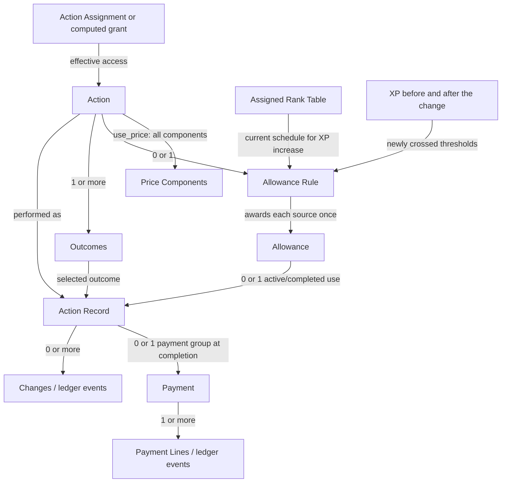
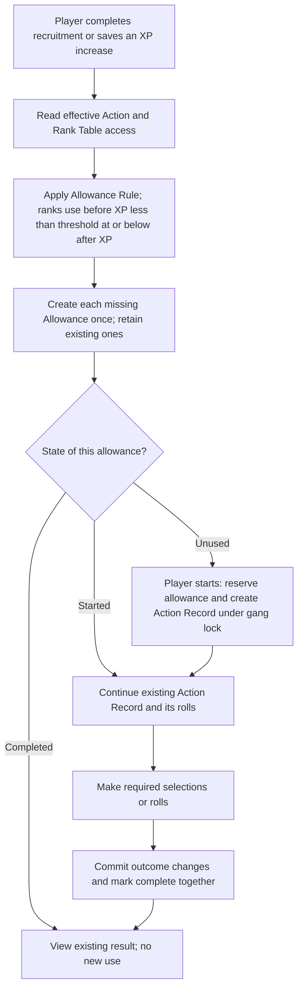
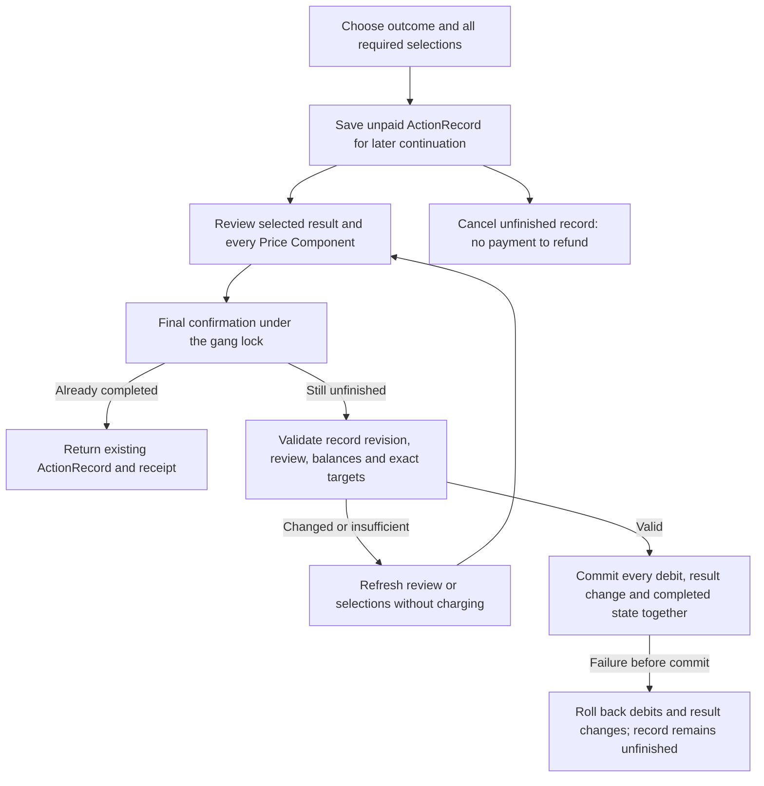

# Actions, allowances and payments — accepted design

This document preserves the accepted design sketch. The application implements Action and RankTable as assignable kinds. See `n26/design/fighter-actions.md` for canonical model and API details.

## Naming

Use Action for assignable content, ActionRecord for one use, and Activity for the surrounding gang task. Rename the existing core.Action to core.Activity when implementing this design.

### Action

Assign Suit Evolution to this fighter. Start a Suit Evolution action.

Names something the fighter can do. Fits both the shop and the rulebook examples.

Trade-off: Can mean the available action or a particular use. Use ActionRecord for the latter. Renaming the existing gang model to Activity would remove the code-name collision.

### Capability

Grant the Suit Evolution capability. Start an action using it.

Makes the distinction between having access and using it explicit. Avoids the existing Action model name.

Trade-off: Broad enough to suggest passive benefits as well as actions. Requires another noun when the player starts a use.

### Activity

Make Suit Evolution available as an activity. Start the activity.

Works for something with several steps and avoids the existing model name.

Trade-off: Use this name for the gang task, such as founding or a Trading Post visit. Action more specifically describes something available for a fighter to perform.

### Procedure

Assign the Suit Evolution procedure. Follow the procedure.

Makes the sequence of steps obvious.

Trade-off: Suggests that content defines a workflow. Here, the supported operation supplies the forms and steps.

### Names in code

- `library.Action`: NEW assignable content: what can be done, its use price, outcomes and optional allowance rule.

- `Assignment(action=...)`: EXTEND the existing assignment registry with a typed reference to library.Action. This stores access; an effective grant can also supply access.

- `core.ActionRecord`: NEW player record: one started or completed use, with its selections, payment and changes.

- `core.Activity (currently core.Action)`: PROPOSED RENAME of the existing gang task: founding or a Trading Post visit. It has open/closed state, groups purchases and tracks its Trade Point budget.

The proposed rename gives each concept its own name: library.Action, core.ActionRecord and core.Activity. Activity keeps the existing gang task’s data and behaviour. Grouping fighter ActionRecords under an Activity would be a separate relationship to design; it is not required by this naming choice.

ActionDefinition was the earlier name for the proposed assignable content model. The current application still calls the gang task core.Action; Activity is the proposed replacement name.

## Entity relationships



## Allowance and payment flow



## Payment flow



Rank grants use the current table during the player-triggered XP-change operation. There is no scheduled assessment or special handling when the table changes.

## Rank grants on XP changes — agreed

```yaml

---
status: AGREED and used by the action definitions and diagrams
recommendation: >-
  Create earned allowances when XP increases. Changing the assigned rank table itself needs no handler,
  history period or replacement baseline.
crossing_test: before < threshold <= after
reuse: >-
  Operation.tally already knows before and after. Read the current effective RankTable and retain the
  existing unique allowance source key.
extension: >-
  Run the rank allowance rule during an XP increase and save new allowances in the same transaction. The
  player still chooses and applies the advancement during the post-cycle flow.
table_change_example:
  xp_when_table_changes: 55
  replacement_thresholds:
  - 50
  - 60
  - 70
  on_table_change: >-
    No grant calculation. Unused allowances remain available; started and completed allowances keep their
    records.
  next_xp_increase:
    before: 55
    after: 60
    new_allowance_thresholds:
    - 60
initial_counter_value: >-
  Opening a counter with starting XP does not cross earned thresholds. Existing built-in counters open
  directly at member.amount.
existing_fighters: >-
  One-off initial setup assumes all eligible past advancements are unused; no reconstruction or owner
  reconciliation of past use.
literal_do_nothing_with_original_scan:
  behaviour: >-
    At the next post-cycle assessment, scan the currently assigned table and create each eligible threshold
    that has no allowance record.
  trade_off: >-
    A replacement threshold of 50 can grant another allowance at 55 XP even when an old-table allowance
    at 49 already exists. This does not preserve the agreed future-only behaviour.
  status: Earlier alternative, not selected
scope: >-
  Rank grants run inside the user-triggered XP-change operation. No automatic background processing and
  no table-change operation. Initial existing-fighter setup is separate and assumes no previous advancements
  taken.
allowance_rule:
  kind: rank
  event: counter_increased
  counter: xp
  rank_table_from: acting_fighter_effective_rank_table


```

## Assignability

```yaml

---
- name: Action
  recommendation: 'YES'
  reason: >-
    A fighter can possess and lose access to it through existing built-ins, grants and removals. A use
    is a separate ActionRecord.
- name: RankTable
  recommendation: 'YES'
  reason: >-
    A fighter has an effective progression schedule which may differ by profile and change through modifiers.
- name: Outcome
  recommendation: NO FOR NOW
  reason: >-
    A result template belongs to action content. Performing it records changes; it does not make the fighter
    hold the outcome definition.
- name: AllowanceRule
  recommendation: NO FOR NOW
  reason: A policy of an action. Different rank schedules are already represented by assigned RankTables.
- name: Price / PriceComponent
  recommendation: 'NO'
  reason: Terms of a transaction, not held game content.
- name: Allowance / ActionRecord / Payment / Change / SkillSelection
  recommendation: 'NO'
  reason: Player records and historical evidence. Archiving a source assignment must not erase or replay
    them.


```

## Shared purchase/payment refactoring

```yaml

---
recommendation: >-
  Generalise transaction values and payment execution; leave collection discovery and equipment price
  calculation behind adapters.
existing:
- Collection price_of computes credits and Trade Points, with overrides.
- >-
  Operation.buy/assign records actual payment and acquisition. LedgerEntry stores paid, trade_points,
  rating and provenance.
- >-
  LedgerEvent already stores credit and Trade Point deltas. total_spent sums standalone gang credit events
  as well as acquisition events.
- >-
  Trade Points belong to the original founding/trading action and spent_by; they are not a persistent
  counter.
shared_contract:
- Quote -> list of PriceComponents resolving to exact balances.
- >-
  Pay -> after all selections, verify every debit under the gang lock and write payment-line events atomically
  with the acquired item or the completed ActionRecord and its result changes.
- Receipt -> reconstruct actual payment lines from events.
- Refund -> explicitly reverse original payment lines against their original sources.
migration_order:
- Implement counter/credit action payments through a common payment primitive inside operation().
- >-
  Adapt equipment credit/Trade Point quotes to the same value representation without changing collection
  selection or pricing composition.
- >-
  Route acquisition payment writes through the primitive, keeping the acquisition assignment as the ledger
  subject and preserving LedgerEntry folding.
- >-
  Extend refund grouping and reconciliation tests before migrating more paths. Avoid recording both the
  old debit and the new debit.
constraints:
- >-
  Signed catalogue prices, discounts, free acquisitions, negative equipment price adjustments and rating
  contribution are existing behaviours. A positive action-price component constraint must not silently
  change them.
- Built-in acquisitions may produce several entries; each entry’s ledger fold must remain valid.
- No collection migration is claimed complete or required to approve these action definitions.


```

## Mixed-price example

```yaml

---
name: Illustrative action, not a rulebook price
use_price:
- resource: credits
  payer: gang
  amount: 50
- resource: counter
  payer: fighter
  counter: kill_count
  amount: 4
before:
  gang_credits: 80
  fighter_kill_count: 6
after:
  gang_credits: 30
  fighter_kill_count: 2
if_either_is_insufficient: no debit or result change; leave the action unfinished for revised review or
  cancellation


```

## Reuse and extensions

```yaml

---
- concept: Who a modifier reaches
  status: REUSE UNCHANGED
  implementation: TargetsMiniature(reach=bearer/every_model), existing condition models, as_selector()
  source: n26/library/models/modifier.py:153
  use: The same scopes offer actions to the bearer or every fighter in the gang.
- concept: Matching profiles, subtypes and counter thresholds
  status: REUSE UNCHANGED
  implementation: IsProfile, HasSubtypes, CounterAtLeast and n26.core.select Has/Exactly/All/Any
  source: n26/library/models/modifier.py:342
  use: >-
    Any narrowing uses these persisted condition rows and their existing selector compilation. No has_rule/keeps_counter
    configuration language.
- concept: Applicability notes
  status: REUSE MIXIN ON NEW MODEL
  implementation: UsableBy and usable_by_selector()
  source: n26/library/models/assignable.py:283
  use: Action inherits the existing three lists, default-open semantics and notes.
- concept: Where access comes from
  status: REUSE PATTERN; EXTEND PIPELINE
  implementation: Assignment, built-ins, AddsAssignable/RemovesAssignable and provenance
  source: n26/core/access.py:1
  use: >-
    Register Action and RankTable as assignable/grantable kinds; extend access readers. No OffersAction
    effect or new eligibility grammar.
- concept: Primary and Secondary skills
  status: REUSE UNCHANGED
  implementation: Existing category placements, skill grid, sections and skill UsableBy
  source: n26/core/access.py:178
  use: >-
    Read the fighter’s existing skill access. Any-skill advancement deliberately includes all sets, with
    existing usability notes. The guided random procedure rerolls duplicates/unusable results as the rules
    specify.
- concept: An earned use
  status: NEW
  implementation: AllowanceRule, ActionAllowance, RankTable
  source:
  use: >-
    Record each crossed threshold once when the player saves an XP increase, using the current assigned
    table. Keep earned records when access changes.
- concept: Starting and completing a use
  status: NEW MODELS; REUSE TRANSACTION BOUNDARY
  implementation: Action, Outcome, ActionRecord; operation(gang)
  source: n26/core/operations.py:2812
  use: Distinct action lifecycle with existing gang locking and atomic writes.
- concept: What was paid or changed
  status: EXTEND EXISTING LEDGER
  implementation: LedgerEvent action link, payment kinds, structured counter movements and reversal links
  source: n26/core/models/ledger.py:143
  use: >-
    Group payment-line events; extend counter movement fields and receipt/refund readers. Existing standalone
    credit summation already applies. Preserve acquisition ledger folds during future reuse.
- concept: Tier progression
  status: EXTEND EXISTING SLOTS/PICKLIST MEMBERS
  implementation: Ladder mode plus numeric member levels
  source: n26/library/models/slots.py:450
  use: Keep existing item slots and pickable effects; add enough structure to calculate the next tier.
- concept: Skill follow-up
  status: EXTEND EXISTING OFFER; NEW SELECTION RECORD
  implementation: OffersChoice select/random mode, SkillSelection, recorded skill-table rolls
  source: n26/library/models/modifier.py:1243
  use: Reuse skill selection/access and add the missing random mode and action completion link.
- concept: Counter clearing and pick removal
  status: REUSE + EXPLICIT EXTENSION
  implementation: OpChangesCounter configuration and Operation.remove; new action invocation and RemovePicks
    mutation
  source: n26/library/models/modifier.py:1689
  use: >-
    Apply both atomically for Clear glitches. The counter assignment remains; held glitch picks are removed.
- concept: Rank tables as held content
  status: NEW ASSIGNABLE KIND
  implementation: RankTable plus existing Assignment, built-in, grant and removal machinery
  source: n26/library/models/modifier.py:90
  use: >-
    Follows existing assignable AssetTable precedent. Add explicit registry fields and an effective-table
    reader.


```

## Availability wiring

```yaml

---
status: >-
  PROPOSED CONTENT: REUSE EXISTING SCOPES, AddsAssignable AND ASSIGNMENT GRANTS; REGISTER NEW ASSIGNABLE
  KINDS
bindings:
  spyrer_evolution:
    attached_to:
      kind: Rule
      ref: spyrer_rule
    scope:
      kind: TargetsMiniature
      reach: bearer
      conditions: []
    effect:
      kind: AddsAssignable
      action: suit_evolution
  spyrer_maintenance:
    attached_to:
      kind: Rule
      ref: spyrer_rule
    scope:
      kind: TargetsMiniature
      reach: bearer
      conditions: []
    effect:
      kind: AddsAssignable
      action: suit_maintenance
  hunt_master_recruitment:
    attached_to:
      kind: Profile
      ref: spyre_hunt_master
    scope:
      kind: TargetsMiniature
      reach: bearer
      conditions: []
    effect:
      kind: AddsAssignable
      action: hunt_master_augmentation
  standard_advancement:
    attached_to:
      kind: Rule
      ref: model_progression_rule
    scope:
      kind: TargetsMiniature
      reach: every_model
      conditions: []
    effect:
      kind: AddsAssignable
      action: model_advancement
  standard_rank_table:
    attached_to:
      kind: Rule
      ref: model_progression_rule
    scope:
      kind: TargetsMiniature
      reach: every_model
      conditions: []
    effect:
      kind: AddsAssignable
      rank_table: model_ranks
reference_notes:
- >-
  Action and RankTable become assignable kinds. Existing typed grant/removal and assignment fields must
  explicitly be extended for both.
- >-
  The named carriers are illustrative content wiring. Existing Rule/Profile kinds supply the carriers;
  the exact named seeds may need authoring.
- >-
  The same action can be held by two fighters with different RankTables. The action’s allowance rule reads
  the fighter’s effective table.
- >-
  The model progression Rule can grant a default rank table to all fighters. A different table requires
  an explicit removal/replacement of that default, so two effective tables do not silently compete.
- >-
  Blank UsableBy lists mean unrestricted only when all three lists are empty. They retain current applicability-note
  semantics.


```

## Four actions

```yaml

---
suit_evolution:
  name: Suit Evolution
  subject: fighter
  timing: post_cycle
  outcomes:
  - augment_carried_item
  - clear_glitches
  usable_by_profile_types: []
  usable_by_subtypes: []
  usable_by_profiles: []
  allowance_rule:
  use_price:
  - resource: counter
    payer: fighter
    counter: kill_count
    amount: 4
  price: 0
suit_maintenance:
  name: Suit Maintenance
  subject: fighter
  timing: post_cycle
  outcomes:
  - clear_glitches
  usable_by_profile_types: []
  usable_by_subtypes: []
  usable_by_profiles: []
  allowance_rule:
  use_price:
  - resource: credits
    payer: gang
    amount: 100
  price: 0
hunt_master_augmentation:
  name: Recruitment augmentation
  subject: fighter
  timing: recruitment
  outcomes:
  - augment_carried_item
  usable_by_profile_types: []
  usable_by_subtypes: []
  usable_by_profiles: []
  allowance_rule:
    kind: recruitment
    event: recruitment_completed
    quantity: 1
  use_price: []
  price: 0
model_advancement:
  name: Advancement
  subject: fighter
  timing: post_cycle
  outcomes:
  - resolve_advancement
  usable_by_profile_types: []
  usable_by_subtypes: []
  usable_by_profiles: []
  allowance_rule:
    kind: rank
    event: counter_increased
    counter: xp
    rank_table_from: acting_fighter_effective_rank_table
  use_price: []
  price: 0


```

## Domain definitions

### Action — NEW ASSIGNABLE KIND; EXTEND EXISTING REGISTRIES

An assignable capability: a fighter with effective access to this action may start a use. Its definition names the price of a use, possible outcomes and any earned allowance required.

PROPOSED NEW ASSIGNABLE KIND: library.Action(Content, Assignable, UsableBy). Extend existing assignment, built-in, grant and removal registries.

```yaml

---
id: content ID
name: player-facing name
subject: fighter (initial supported subject)
timing: recruitment | post_cycle; describes where it is offered, not a campaign phase enforcement engine
outcomes: ordered, non-empty references to Outcome; exactly one is selected per use
usable_by_profile_types: 'EXISTING UsableBy M2M: ProfileType references; combined with the other two lists.'
usable_by_subtypes: 'EXISTING UsableBy M2M: Subtype references; combined with the other two lists.'
usable_by_profiles: 'EXISTING UsableBy M2M: Profile references; combined with the other two lists.'
allowance_rule: >-
  NEW optional RecruitmentAllowanceRule or RankAllowanceRule. Null means no earned allowance is required;
  each paid use still records its payment.
use_price: >-
  ordered list of PriceComponent, charged at final confirmation after all selections; [] means a use has
  no payment
price: >-
  EXISTING inherited credit price of acquiring the action capability; fixed at 0 for these actions. Distinct
  from use_price.


```

- An action with an allowance rule has an empty use_price in these four definitions. Combining a price and an allowance is deferred.

- Each action use selects exactly one listed outcome. A sole outcome is selected automatically.

- Assigning an action capability never executes its outcomes. Starting a use creates an ActionRecord; results are applied only by that record’s operation.

- Access comes from held Action assignments and existing AddsAssignable/RemovesAssignable effects extended to name this kind. UsableBy adds the existing applicability notes. No action-specific eligibility language or Availability table is introduced.

- UsableBy is unrestricted when all three lists are empty; otherwise any matching entry is sufficient. It and other game restrictions retain the existing inform-not-police behaviour. Exact payment, ownership, stale-target checks and preventing duplicate allowance use are accounting/data-integrity checks.

- Assigning or granting the capability does not perform it, charge use_price or create an allowance. Recruitment/rank hooks create allowances separately.

### Outcome — NEW CONTENT MODEL

A named result an action can produce. Several actions may refer to the same outcome.

NEW library content with one typed operation configuration; action membership supplies ordering. It is not assignable.

```yaml

---
id: content ID
name: player-facing name
operation: 'AugmentCarriedItem | ResolveAdvancement | ApplyChanges(changes: list[CounterChange | RemovePicks])'


```

- Operations are explicitly supported typed code. ApplyChanges composes a small set of mutations in one transaction; it is not an author-defined branching workflow.

- Their selection forms determine the progress indicator. Progress labels are presentation, not saved game state.

- Each supported outcome operation supplies validation, reversal and replacement of its result for corrections. The shared correction operation checks the record revision and affected history, then reverses and replaces the result atomically. This is typed application code, not a content-authored workflow.

### Price — NEW USE-PRICE LIST; FUTURE SHARED PRICE VALUE

The full price of one use: every component is required. The list means AND, not alternative ways of paying.

NEW use_price component rows attached to Action; normalised to a shared Price value before confirmation. Future collection prices can adapt to this value.

```yaml

---
components: ordered list[PriceComponent]
combination: all components required


```

- An empty component list means no payment. Each action component has a positive amount.

- Coalesce components that resolve to the same balance, then verify the total under the gang lock. Repeating a counter in the list must not bypass affordability.

- Confirm the full list after all selections. All component debits, result changes and completion of the action record commit or roll back together. Saving unfinished choices does not pay or reserve balances.

- Preserve the accepted components on the action record. Future content edits cannot reprice an existing payment.

- Alternatives such as credits OR Kill Count would be an explicit future payment-method choice, not another meaning for this list.

- Inherited Assignable.price describes acquiring an action capability; use_price describes performing it. Keep those separate. The initial capabilities are all free.

### Allowance — NEW PLAYER MODEL

One earned or granted use of an action, such as the advancement at 49 XP. This is internal bookkeeping, not a player-facing token.

New player-data model ActionAllowance.

```yaml

---
id: record ID
action: library.Action reference
fighter: Miniature reference
recruitment: membership Assignment reference
source:
  kind: recruitment | rank
  threshold: integer for rank; null for recruitment
  rank_table: RankTable content reference and acquisition provenance for rank grants; null for recruitment
granted_event: LedgerEvent reference


```

- RecruitmentSource uniqueness: action + recruitment. RankSource uniqueness: action + recruitment + threshold.

- An allowance may have at most one started or completed action record. Cancellation before any roll can release it. After a roll, retain the same unfinished record for continuation or correction.

- Payment-funded actions do not need allowances.

- Rank grants remain unique on action + recruitment + threshold. Changing tables never clears these records or grants anything by itself. A later XP increase uses the current table; re-crossing an already recorded threshold cannot grant it twice.

### Action record — NEW PLAYER MODEL

One use of an action, including an unfinished use the player can continue.

New player-data model core.ActionRecord. The existing gang core.Action would be renamed core.Activity.

```yaml

---
id: record ID
request_key: >-
  unique use ID scoped to the gang; repeated starts or final confirmations address the same record. Completed
  records return their receipt without another payment.
action: library.Action reference
fighter: Miniature reference
gang: Gang reference at start
allowance: Allowance reference or null
outcome: Outcome reference
state: started | completed | cancelled
terms: >-
  accepted snapshot of action/outcome names, use_price components, operation configuration and exact content
  references; finalised with completion. Unpaid review terms can be refreshed. Recorded advancement rolls
  retain their original rule context.
started_event: LedgerEvent reference
completed_event: LedgerEvent reference or null
selection:
  AugmentationSelection:
    item_assignment: Assignment or null until selected
    slot_assignment: Assignment or null
    previous_pick: Assignment or null for level zero
    new_pick: Assignment or null until committed
    intended_pick: Pickable reference selected before checkout; new_pick remains null until completion
  AdvancementSelection:
    slot_assignment: Assignment reference
    roll_event: LedgerEvent reference
    intended_pick: Pickable reference or null
    pick_assignment: Assignment reference or null until committed
    skill_choice: SkillSelection or null
  AppliedChangesResult:
    change_events: ordered LedgerEvent references for each applied mutation
revision: integer for detecting stale correction forms
payment_id: payment group UUID or null
source: >-
  source assignment and modifier provenance; may be a computed action grant rather than a direct action
  assignment
review: >-
  optional snapshot for confirmation: proposed price components, selected outcome and item/tier, exact
  balance references and expected before-state. Revalidate under the gang lock; changed figures or targets
  require another review.


```

- Starting or resuming saves unpaid choices. Final confirmation writes every payment debit, the outcome changes and completed state in one existing operation transaction. Both augmentation and direct glitch clearing use this boundary.

- A stable request key identifies one use. Repeated final submissions return its completed record and receipt. While it is unfinished, validate the submitted revision and review snapshot before committing; a stale form cannot apply different choices.

- Selection references identify this fighter’s actual held item or slot assignments, not just their library definitions.

- A completed record remains completed when corrected. Keep its payment, earned allowance and recorded roll; append correction history and update its current selection and revision. An augmentation may move to another carried item when the old result can be safely reversed and the new target is valid. Reverse the old result and apply the replacement in one transaction.

- An unfinished action has no accepted payment. Price, balance, target or relevant content changes require renewed review before completion. Completed terms preserve the accepted transaction; later library edits cannot reprice it.

- Action records and allowances are player history, not Assignments. Removing the capability must not cascade-delete or archive them.

- For priced actions, the player can change the outcome or selections, leave and resume, or cancel the unpaid record before final confirmation. Changing the outcome clears incompatible selections and invalidates its review. Earned advancements reserve their allowance before rolling and record the roll before revealing it. An earned advancement can release its allowance only before a roll; afterwards it continues with the same recorded roll.

- Corrections validate the exact affected state and later changes under the gang lock. If a later upgrade or other dependent change prevents safe reversal, identify that conflict and require it to be resolved first. Never overwrite later work or silently reprice a correction.

### Payment — EXTEND EXISTING LEDGER; GROUP ALL PAYMENT LINES

One accepted payment, consisting of all its debit lines. It records actual movements, not today’s price definition.

EXTEND LedgerEvent with payment_id and action_record links. Payment is the grouped view of its events, not a parallel financial ledger or separate mutable balance.

```yaml

---
id: payment UUID shared by all payment-line events
action_record: ActionRecord reference for these flows
lines: non-empty list of PaymentLine views over ledger events
actor: existing actor
created: existing event timestamps
refunded_by: separate reversal payment group, if explicitly refunded


```

- One original payment group per action record, with one event per normalised component. Record the group ID on the action record. A zero-price use has no payment group.

- Every debit succeeds together with the outcome changes and completed action record. Started actions have no payment group and do not reserve balances.

- Counter debits must pay the whole amount. The current tally clamp-to-zero operation cannot fulfil that contract.

- Credit-spend events retain positive credits_delta. Counter spending has negative counter_delta. Price amounts are positive in both cases.

- Cancelling an unfinished priced action needs no refund. Correcting or removing a completed result never refunds automatically. An explicit Undo and refund must reverse the result and every original payment line together, against the original balance references, after checking for conflicting later changes. That explicit refund operation is deferred from the first release.

- The existing total_spent query already sums standalone gang credit events. Preserve that path, add coverage for the new event shapes, and never also create a second paid acquisition event for the same debit.

- A future equipment adapter must preserve LedgerEntry folding, action-scoped Trade Points and spent_by. Assigning an item and paying for it remain in one operation.

### Change — EXTENSION OF LedgerEvent

Something an action did: a counter changed, an item tier changed, a pick was recorded or a glitch was removed.

Existing ledger events, extended with action_record and structured before/after references where required. No separate general-purpose Change table.

```yaml

---
action_record: ActionRecord reference on each related event
subject: exact affected assignment or fighter
kind: existing event kind, or a specifically added kind where needed
before_after: 'typed fields for the operation: counter numbers or previous/new pick references'
actor_created_batch: existing ledger metadata


```

- A counter adjustment caused by an outcome is a Change, not a Payment. Glitch Count becoming zero does not pay for the action.

- Tier changes link to the existing item slot; the action record does not own that slot through caused_by.

- Counter movements need structured opening and adjustment records for reconciliation. Existing counters require a migration checkpoint; do not parse old notes as financial truth.

- Correction events preserve the exact original result references, affected items and before/after states. Updating ActionRecord.selection must not erase the original history. A cross-item correction links the reversal on the original item and replacement on the new item to the same action record and transaction.

### Tier ladder — EXTENSION OF Slot + PicklistMember

The ordered augmentation tiers for one item. These are cumulative states: selecting a tier replaces the previous tier.

Existing Slot + Picklist + Pickable, extended with explicit ladder mode and unique numeric levels on its members.

```yaml

---
slot: existing item-hosted Slot, max_picks 1
mode: tier_ladder
members: ordered pairs of level and Pickable reference; 1..N
no_pick_level: '0'


```

- Display position or a name such as Tier 2 is not sufficient to calculate a next level. Level is numeric content.

- Each eligible carried item must resolve to exactly one matching augmentation slot assignment. Ambiguous content is an authoring error.

- The previous and replacement tier, item ownership and latest state are checked again when the action completes.

### Rank table — NEW ASSIGNABLE KIND; REUSE GRANTS AND REMOVALS

An assignable XP progression schedule. Different fighters can hold different effective rank tables.

PROPOSED NEW ASSIGNABLE KIND: RankTable(Content, Assignable). Extend assignments, built-ins and AddsAssignable/RemovesAssignable like existing AssetTable.

```yaml

---
id: content ID
counter: XP Counter reference
thresholds: ordered unique positive integers
scope: used by the fighter who effectively holds it; no fixed RankTable FK on the advancement action
price: EXISTING inherited acquisition price, fixed at 0 for these tables


```

- REUSE assignment and computed-grant/removal semantics. A profile can bring its table as a built-in, and modifiers may grant or suppress it.

- A rank grant requires exactly one effective table for the fighter and XP counter. Zero tables means no new rank awards; several tables is an explicit conflict, never first-row-wins.

- Allowances already earned retain the table and threshold used when assessed. Removing that table does not erase the allowances.

- On an XP increase, use the current effective table and grant thresholds where before < threshold <= after. The counter operation already has these values. Opening the counter at its starting XP does not grant advancements.

- Replacing a table has no special operation, history period or new baseline. Keep existing allowances and records. Future XP increases use the replacement table; do not retrospectively grant its earlier thresholds.

### Skill selection — NEW PLAYER MODEL; EXTENDS SKILL OFFERS

The skill choice required by one advancement result, including a chosen skill set and any random rolls.

Proposed typed child record of ActionRecord. It uses existing Skill and category/section content.

```yaml

---
action_record: ActionRecord reference
mode: select | random
access: primary | secondary | any, copied from the selected advancement result
skill_set: Category reference or null until selected
roll_events: ordered LedgerEvent references; every random attempt is retained
selected_skill: Skill reference or null
skill_assignment: Assignment reference or null until committed


```

- A random roll uses the selected set’s authored D6 mapping. Duplicate or unusable results are recorded and rerolled.

- The guided flow offers new, usable skills and follows the random-result reroll rule. Existing UsableBy notes and any owner override remain the shared policy; this proposal adds no separate hard usability enforcement.

- The parent advancement completes only after this selection is resolved. Completing it writes the advancement pick and skill together.

### Action access — REUSE ASSIGNMENT/GRANT PATTERN; EXTEND READERS

A computed listing of an action for a fighter, including the content that offered it.

EXTENSION of existing assignment/effects/access readers to recognise Action. No new stored access model and no new effect kind.

```yaml

---
action: library.Action reference
source: existing modifier carrier/provenance
usability: existing UsableBy result and notes


```

- REUSE: stored assignments, built-ins, AddsAssignable, RemovesAssignable, TargetsMiniature, existing condition rows, selector compilation and provenance.

- EXTEND: Assignment, DefaultAssignment and grant/removal typed fields and registries to name Action. Add computed action contributions and an actions_for reader.

- Follow the existing collection/asset-table access pattern while keeping actions out of collection contents. The computed-card pipeline must remain query-free.

- An action granted by several sources appears once with its provenance. Suppression/removal affects future access.

- AGREED: removing Action access stops new grants. Existing earned allowances and their action records remain usable with their recorded source and roll. Ordinary unpaid shop drafts confer no earned entitlement and recheck effective Action access at checkout, along with ownership and valid targets.

- Affordability does not determine access. Two kills still shows Suit Evolution and its four-kill price.

### Allowance rule — NEW GRANT BOOKKEEPING

When to record one earned or granted use of an already offered action.

NEW typed content configuration owned by the action. This is bookkeeping for grants, not a replacement for availability selectors.

```yaml

---
RecruitmentAllowanceRule:
  event: recruitment_completed
  quantity: 1
RankAllowanceRule:
  event: counter_increased
  counter: existing Counter reference
  rank_table_from: exactly one effective RankTable held by this fighter for the configured counter


```

- Determine which actions and rank tables are effectively held through existing assignments/grants/scopes before assessing new grants.

- NEW hooks: after recruitment settles, create its recruitment allowance; when XP increases, create allowances for crossed thresholds in the same operation transaction. Both follow player actions. There is no scheduled assessment, background job or write caused by rendering a page.

- REUSE the before/after counter values already known to Operation.tally and existing effective-access readers. EXTEND counter-increase processing with a typed rank allowance rule and once-per-threshold records. No CounterBaseline model or table-change checkpoint is needed for ongoing grants.

- Unique source keys on ActionAllowance prevent duplicate grants when those hooks are repeated.

- AllowanceRule remains part of the action definition. The assignable RankTable supplies the variable schedule; a separate assignable allowance rule is unnecessary for these examples.

### Price component — NEW PRICE COMPONENT; EXISTING BALANCES

One required resource and amount in a price.

NEW ActionPriceComponent content rows; reusable typed value for a future payment operation.

```yaml

---
id: stable content component ID
resource: credits | counter; trade_points via future purchase adapter
payer: gang | fighter
counter: Counter reference for counter resource only
amount: positive integer for action use prices
position: display order


```

- Credits resolve to the gang balance. A counter resolves to one stored CounterValue assignment on the named payer.

- Future Trade Points resolve to the original founding/trading action and buyer, not a generic persistent counter.

- The execution quote records exact balance references; a fighter name or current holder of a weapon is insufficient.

### Payment line — EXTENSION OF LedgerEvent

One actual debit from one identified balance.

EXTEND LedgerEvent; a typed view over the event, not another table.

```yaml

---
payment_id: group UUID
component_key: normalised resource/source identity, unique within a payment
balance: gang credits OR exact counter Assignment; future Trade Points includes original action and spent_by
amount: derived from signed event delta
before_after: structured counter values; optional credit receipt snapshots
action_record: provenance link


```

- The event is the accounting record. Do not duplicate the debit in another financial store.

- Counter clearing is a Change, not a PaymentLine: it does not satisfy a price.

### Counter change — REUSE EFFECT DATA; EXTEND INVOCATION

A stored mutation of a specific counter on a specific subject, such as setting Glitch Count to zero.

REUSE existing OpChangesCounter configuration (counter, mode, amount); EXTEND execution so an action can invoke it without creating a dummy carrier assignment.

```yaml

---
subject: acting_fighter
counter: Counter reference
mode: set | add | subtract
amount: integer; zero for clear


```

- Clearing means set to 0, not removing the Counter assignment.

- The recorded event carries before, delta and after. This is a state change and does not count as paying a price.

- The strict payment path is separate from ordinary counter adjustment semantics.

### Remove picks — NEW MUTATION; REUSE REMOVAL PRIMITIVE

Remove all stored picks of a specified slot type held by the subject, including effects that depend on those picks.

NEW typed action mutation; REUSE Assignment filtering, archive/cause-chain removal and rating recomputation.

```yaml

---
subject: acting_fighter
slot_type: SlotType reference
selection: all live Pickable assignments of that slot type held by the fighter


```

- Keep the slot and the counter assignments. Remove the picks and their dependent assignments using the existing removal operation.

- This is a stored removal, not a temporary RemovesAssignable suppression.

## Shared outcomes

```yaml

---
augment_carried_item:
  name: Hunting Rig Augmentation
  operation:
    kind: augment_carried_item
    target:
      holder: acting_fighter
      kinds:
      - weapon
      - wargear
      location: carried
      slot:
        slot_type: augmentation
        mode: tier_ladder
    quantity: 1
    characteristic_maxima: model_characteristic_maxima
    change:
      from: current_level
      by: 1
      if_characteristic_maximum_exceeded: try_one_additional_level
      if_no_valid_target: do_not_start
    completion: replace_selected_item_tier
    rating: from_resulting_content; no action surcharge
    correction: replace_item_and_level_with_validated_atomic_reversal
resolve_advancement:
  name: Advancement
  operation:
    kind: resolve_advancement
    target: acting_fighter
    slot: model_advancement
    instances: one_slot_assignment_per_action_record
    table: model_advancement_table
    roll:
      dice: 2d6
      selection: threshold_at_or_below_roll
      record_before_choice: true
    characteristic_maxima: model_characteristic_maxima
    if_no_result_can_be_gained: allow_any_result_from_table
    completion: advancement_pick_and_any_required_skill_choice_recorded
    rating: selected_advancement_pick.rating_contribution
    skill_rating: 0 additional for the skill acquired through this advancement
clear_glitches:
  name: Clear glitches
  operation:
    kind: apply_changes
    changes:
    - kind: counter_change
      subject: acting_fighter
      counter: glitch_count
      mode: set
      amount: 0
    - kind: remove_picks
      subject: acting_fighter
      slot_type: spyrer_glitch
    commit: all_changes_together
    rating: recompute_from_remaining_assignments


```

## Referenced content

```yaml

---
model_ranks:
  kind: RankTable
  counter: xp
  thresholds:
  - 4
  - 7
  - 10
  - 13
  - 19
  - 25
  - 31
  - 37
  - 49
  - 61
  - 73
  - 85
  - 97
  - 109
  - 121
  - 133
  - 157
  - 181
  - 205
  - 229
  assignable: true
model_advancement:
  kind: Slot
  slot_type: advancement
  picklist: model_advancement_table
  min_picks: 1
  max_picks: 1
model_advancement_table:
  kind: Picklist
  slot_type: advancement
  dice: 2d6
  roll_selects: threshold
  members:
  - id: advance_leadership
    roll_minimum: 2
    rating_contribution: 5
    effect:
      kind: improve_characteristic
      characteristic: leadership
      steps: 1
  - id: advance_intelligence
    roll_minimum: 2
    rating_contribution: 5
    effect:
      kind: improve_characteristic
      characteristic: intelligence
      steps: 1
  - id: random_primary_skill
    roll_minimum: 2
    rating_contribution: 5
    effect:
      kind: offers_skill
      selection: random
      from: primary
      relative_to: acting_fighter
      quantity: 1
      duplicate_policy: new_skill
      type_restrictions: must_be_usable_by_fighter
      skill_set_selection: player_selects_an_eligible_set
      random_roll:
        dice: d6
        mapping: selected_skill_set_table
        unusable_or_already_held: record_roll_then_reroll
        if_no_usable_skill: select_another_eligible_set
  - id: advance_cool
    roll_minimum: 3
    rating_contribution: 5
    effect:
      kind: improve_characteristic
      characteristic: cool
      steps: 1
  - id: advance_willpower
    roll_minimum: 3
    rating_contribution: 5
    effect:
      kind: improve_characteristic
      characteristic: willpower
      steps: 1
  - id: select_primary_skill
    roll_minimum: 5
    rating_contribution: 10
    effect:
      kind: offers_skill
      selection: select
      from: primary
      relative_to: acting_fighter
      quantity: 1
      duplicate_policy: new_skill
      type_restrictions: must_be_usable_by_fighter
      skill_set_selection: player_selects_an_eligible_set
      random_roll:
  - id: random_secondary_skill
    roll_minimum: 5
    rating_contribution: 10
    effect:
      kind: offers_skill
      selection: random
      from: secondary
      relative_to: acting_fighter
      quantity: 1
      duplicate_policy: new_skill
      type_restrictions: must_be_usable_by_fighter
      skill_set_selection: player_selects_an_eligible_set
      random_roll:
        dice: d6
        mapping: selected_skill_set_table
        unusable_or_already_held: record_roll_then_reroll
        if_no_usable_skill: select_another_eligible_set
  - id: advance_initiative
    roll_minimum: 6
    rating_contribution: 10
    effect:
      kind: improve_characteristic
      characteristic: initiative
      steps: 1
  - id: advance_movement
    roll_minimum: 6
    rating_contribution: 10
    effect:
      kind: improve_characteristic
      characteristic: movement
      steps: 1
  - id: select_secondary_skill
    roll_minimum: 7
    rating_contribution: 15
    effect:
      kind: offers_skill
      selection: select
      from: secondary
      relative_to: acting_fighter
      quantity: 1
      duplicate_policy: new_skill
      type_restrictions: must_be_usable_by_fighter
      skill_set_selection: player_selects_an_eligible_set
      random_roll:
  - id: advance_weapon_skill
    roll_minimum: 9
    rating_contribution: 15
    effect:
      kind: improve_characteristic
      characteristic: weapon_skill
      steps: 1
  - id: advance_ballistic_skill
    roll_minimum: 9
    rating_contribution: 15
    effect:
      kind: improve_characteristic
      characteristic: ballistic_skill
      steps: 1
  - id: advance_strength
    roll_minimum: 10
    rating_contribution: 20
    effect:
      kind: improve_characteristic
      characteristic: strength
      steps: 1
  - id: advance_toughness
    roll_minimum: 10
    rating_contribution: 20
    effect:
      kind: improve_characteristic
      characteristic: toughness
      steps: 1
  - id: advance_wounds
    roll_minimum: 11
    rating_contribution: 20
    effect:
      kind: improve_characteristic
      characteristic: wounds
      steps: 1
  - id: advance_attacks
    roll_minimum: 11
    rating_contribution: 20
    effect:
      kind: improve_characteristic
      characteristic: attacks
      steps: 1
  - id: advance_save
    roll_minimum: 11
    rating_contribution: 20
    effect:
      kind: improve_characteristic
      characteristic: save
      steps: 1
  - id: select_any_skill
    roll_minimum: 12
    rating_contribution: 30
    effect:
      kind: offers_skill
      selection: select
      from: any
      relative_to: acting_fighter
      quantity: 1
      duplicate_policy: new_skill
      type_restrictions: must_be_usable_by_fighter
      skill_set_selection: player_selects_an_eligible_set
      random_roll:
model_characteristic_maxima:
  movement: 12
  weapon_skill: 2+
  ballistic_skill: 2+
  strength: 10
  toughness: 10
  wounds: 10
  initiative: 10
  attacks: 10
  save: 3+
  leadership: 10
  cool: 10
  willpower: 10
  intelligence: 10
paired_bolt_launchers_augmentation:
  kind: TierLadder
  slot_type: augmentation
  host_item: paired_bolt_launchers
  max_picks: 1
  members:
  - level: 1
    pickable: paired_bolt_launchers_tier_1
  - level: 2
    pickable: paired_bolt_launchers_tier_2
  - level: 3
    pickable: paired_bolt_launchers_tier_3
orrus_rig_augmentation:
  kind: TierLadder
  slot_type: augmentation
  host_item: orrus_hunting_rig
  max_picks: 1
  members:
  - level: 1
    pickable: orrus_rig_tier_1
  - level: 2
    pickable: orrus_rig_tier_2
skill_tables:
  agility:
    dice: d6
    faces:
      '1': Catfall
      '2': Clamber
      '3': Dodge
      '4': Mighty Leap
      '5': Spring Up
      '6': Sprint
  brawn:
    dice: d6
    faces:
      '1': Bull Charge
      '2': Bulging Biceps
      '3': Fearsome
      '4': Iron Jaw
      '5': Nerves of Steel
      '6': Unstoppable
  combat:
    dice: d6
    faces:
      '1': Berserker
      '2': Combat Master
      '3': Headbutt
      '4': Heavy Blows
      '5': Rain of Blows
      '6': Two-weapon Fighter
  cunning:
    dice: d6
    faces:
      '1': Backstab
      '2': Counter-attack
      '3': Cut-throat
      '4': Infiltrate
      '5': Lie Low
      '6': Overwatch
  savant:
    dice: d6
    faces:
      '1': Connected
      '2': Fast Reload
      '3': Iron Will
      '4': Medicate
      '5': Mentor
      '6': Munitioneer
  shooting:
    dice: d6
    faces:
      '1': Fast Shot
      '2': Gunfighter
      '3': Hip-shooting
      '4': Marksman
      '5': Precision Shot
      '6': Sharpshooter
reference_contract: >-
  Symbolic references above stand for existing or proposed library rows, not string matching in production.
  Every augmentable weapon and rig supplies its own ladder; the two examples demonstrate different lengths.
  Skill Primary/Secondary membership is evaluated for this fighter using existing categories. Existing
  tier effects stay on their Pickables.


```

## Example records

```yaml

---
- id: evolution_1
  action: suit_evolution
  fighter: vaelen
  gang: ash_hunters
  request_key: confirm_evolution_1
  allowance:
  outcome: augment_carried_item
  state: started
  payment:
  selection:
    item_assignment:
    slot_assignment:
    previous_pick:
    new_pick:
  next: Choose one carried item and tier, then review. Leaving saves these unpaid choices.
- id: evolution_1
  state: started
  payment:
  selection:
    item_assignment: vaelen_bolt_launchers_1
    slot_assignment: vaelen_bolt_launchers_1_augmentation
    previous_pick: bolt_tier_1_assignment
    intended_pick: bolt_tier_2
    new_pick:
  review:
    counter_assignment: vaelen_kill_count
    available: 8
    price: 4
    after_payment: 4
    item_before_level: 1
    item_after_level: 2
  next: Confirm to pay and apply this tier together, change the choices, or cancel.
- id: evolution_1
  state: completed
  selection:
    item_assignment: vaelen_bolt_launchers_1
    slot_assignment: vaelen_bolt_launchers_1_augmentation
    previous_pick: bolt_tier_1_assignment
    new_pick: bolt_tier_2_assignment
  changes:
  - kind: tier_changed
    before_level: 1
    after_level: 2
  payment:
    id: payment_for_evolution_1
    lines:
    - event: payment_1
      counter_assignment: vaelen_kill_count
      counter_before: 8
      counter_delta: -4
      counter_after: 4
  completion: >-
    Payment, tier change and completed state were committed together. Repeating confirm_evolution_1 returns
    this receipt.
- id: evolution_1
  state: completed
  revision: 2
  scenario: >-
    Correction to another item, before any later conflicting tier change. This is an alternative continuation
    of the completed example.
  payment: payment_for_evolution_1 unchanged
  allowance:
  selection:
    item_assignment: vaelen_orrus_rig_1
    slot_assignment: vaelen_orrus_rig_1_augmentation
    previous_pick:
    new_pick: rig_tier_1_assignment
  correction_events:
  - kind: reverse_previous_result
    subject: vaelen_bolt_launchers_1_augmentation
    before_level: 2
    after_level: 1
  - kind: apply_replacement_result
    subject: vaelen_orrus_rig_1_augmentation
    before_level: 0
    after_level: 1
  transaction: >-
    Both item changes, current selection, revision and correction events commit together. No payment movement.
    Original completion and change history remain recorded.
- id: evolution_2
  action: suit_evolution
  fighter: vaelen
  allowance:
  outcome: clear_glitches
  state: completed
  payment:
    id: payment_for_evolution_2
    lines:
    - counter_assignment: vaelen_kill_count
      counter_before: 4
      counter_delta: -4
      counter_after: 0
  changes:
  - counter_assignment: vaelen_glitch_count
    before: 2
    delta: -2
    after: 0
  - removed_pick_assignments:
    - vaelen_glitch_a
    - vaelen_glitch_b
- id: maintenance_1
  action: suit_maintenance
  fighter: other_spyrer
  allowance:
  outcome: clear_glitches
  state: completed
  payment:
    id: payment_for_maintenance_1
    lines:
    - payer: ash_hunters
      credits_before: 140
      credits_delta: 100
      credits_after: 40
  changes:
  - counter_assignment: other_spyrer_glitch_count
    before: 2
    delta: -2
    after: 0
  - removed_pick_assignments:
    - other_glitch_a
    - other_glitch_b
- id: recruitment_augmentation_1
  action: hunt_master_augmentation
  fighter: hunt_master_1
  allowance:
    id: hunt_master_bonus
    source:
      kind: recruitment
      membership: hunt_master_membership_1
  outcome: augment_carried_item
  state: started
  payment:
  selection:
    item_assignment:
    slot_assignment:
    previous_pick:
    new_pick:
- fighter: vex
  current_xp: 61
  allowances:
  - id: advance_at_49
    action: model_advancement
    source:
      kind: rank
      membership: vex_membership_1
      threshold: 49
  - id: advance_at_61
    action: model_advancement
    source:
      kind: rank
      membership: vex_membership_1
      threshold: 61
  xp_change:
    before: 48
    after: 61
    grant_thresholds:
    - 49
    - 61
- id: advancement_49
  action: model_advancement
  fighter: vex
  allowance: advance_at_49
  outcome: resolve_advancement
  state: completed
  payment:
  selection:
    slot_assignment: vex_advancement_49_slot
    roll_event: vex_roll_9
    roll: 9
    pick: advance_weapon_skill
    pick_assignment: vex_advancement_49_ws
    skill_choice:
  changes:
  - rating_delta: 15
  xp_after: 61
- id: advancement_61
  action: model_advancement
  fighter: vex
  allowance: advance_at_61
  outcome: resolve_advancement
  state: started
  payment:
  selection:
    slot_assignment: vex_advancement_61_slot
    roll_event: vex_roll_5
    roll: 5
    pick: random_secondary_skill
    pick_assignment:
    skill_choice:
      mode: random
      skill_set:
      roll_events: []
      skill_assignment:
  next: >-
    Select a Secondary skill set and roll its D6 table, then commit the advancement pick and skill together.


```

## Design notes

### Clearing a counter is not clearing all glitches

Set the linked Glitch Count to zero using the existing counter-change shape. Also remove all held glitch picks, whose penalties otherwise remain. The Clear glitches outcome lists both mutations and commits them together. The same outcome is shared by Suit Evolution and Suit Maintenance.

### Revisions proposed in this pass

Make Action and RankTable assignable; this replaces OffersAction with existing assignment/grant/removal concepts. Use a list of price components. Clear glitches becomes a generic counter change plus a typed removal of picks. These are proposed refinements for discussion, not implemented changes.

### How to read the status labels

REUSE means the named concept and behaviour already exist. EXTEND means an existing model or pipeline needs the specified fields or reader. NEW means a new domain model, effect or operation. All four action definitions are proposed content; symbolic YAML references are not an import API.

### What is already supported

Counters, held item assignments, slots, picklists, roll thresholds, picks, modifiers, skill categories and the gang-locked operation boundary already exist. Register Action and RankTable as new assignable kinds and extend the existing readers. Action records, allowances, list prices for action uses, structured counter payments and numeric ladder levels remain proposed additions. Seeded Power Boost material is not used by these definitions.

### Checkout timing — agreed

For priced actions, choose the outcome and finish every required selection before final confirmation. Starting or resuming saves an unpaid ActionRecord. Confirmation revalidates the review and commits payment, result changes and completed state together. Clearing glitches uses the same checkout and skips item selection. Cancelling these unpaid actions needs no refund. Earned advancements reserve their allowance before rolling and can release it only before a roll; afterwards they continue with the recorded roll. The prototype now follows this checkout order.

### Random skill outcomes need an extension

Existing OffersChoice can select a skill but does not express random selection. The offers_skill configuration proposes select/random modes. The player selects an eligible skill set, then a D6 selects its numbered skill. Record every roll; unusable or already-held results require another roll. The local n26 skill rules specify this reroll behaviour. Skill tables are included below as symbolic references to existing skills. The ordinary per-slot roll API cannot currently roll a skill offer: add a SkillSelection record with its chosen set, mode, roll events and final skill. An any-skill result includes exclusive and Inherent skill sets, subject to the fighter’s Type/Subtype restrictions.

### Ratings and pending results

Characteristic improvements and advancement rating are held by the chosen advancement Pickable. A skill granted through that pick adds zero additional rating. The selected result can be saved as an intention on the action record while a skill is still pending; the actual pick and skill are written together at completion. Slot assignments created for the action can be owned by its record through a dedicated relation. Existing item slots are only referenced, never adopted as dependent results of the action.

### Completed-result corrections — agreed

Correct the result through the same completed ActionRecord. Keep the original payment, earned allowance and recorded roll; update effects and rating through the corrected picks. An augmentation can move to another carried item: reverse the original result and apply the replacement together. If later changes prevent safe reversal, show the conflicting change and require it to be resolved first. Each outcome supplies typed reversal and replacement behaviour. Editing or removing a result never refunds automatically. An explicit Undo and refund would reverse the result and original payment together with the same conflict checks; that explicit refund operation is deferred from the first release.

### Content changes and later item changes

At final confirmation, validate the balance, price, exact carried item and its current tier against the review. If any changed, refresh the review or return to selection without charging. An unpaid record can be resumed but does not reserve its quoted balances. Once completed, preserve the accepted payment and before/after facts. Recorded advancement rolls retain their original rule context. Deleted or incompatible content needs an explicit correction or cancellation; full modifier versioning is outside this sketch.

### No-effect purchases — agreed

Before charging, check whether the selected outcome has a valid target. All items at maximum tier makes augmentation unavailable. If the next tier exceeds a characteristic maximum, try the additional tier specified by the rule. Exhausting the ladder without a valid tier requires a rule decision; do not charge for an impossible choice. Clearing glitches is available when either the counter is nonzero or glitch picks remain. Refuse checkout only when both are empty. Each outcome supplies its valid-target and no-effect explanation to the shared checkout operation.

### Timing is not an action budget

post_cycle describes when these actions are offered. This sketch does not account for which post-cycle action a fighter has already used. In particular, repeatable means separate uses can be recorded; it does not grant unlimited rulebook permission to perform Suit Maintenance. Suit Evolution repeats still pay four Kill Count each time. Campaign timing and action limits remain guidance; a campaign-phase or action-budget enforcement engine is outside the first release.

### Collision with the current Action model

Use library.Action for assignable content and core.ActionRecord for one fighter use. Rename existing core.Action to core.Activity for gang founding and Trading Post visits, preserving its records, references and behaviour through a migration. This proposal does not merge their lifecycles or require fighter action records to belong to an activity.

### First implementation scope — agreed

Checkout timing, correction policy, preservation of earned choices, access checks for unpaid drafts and rank grants on player-saved XP increases are agreed. Existing fighters are assumed to have taken no advancements. Refuse purchases that produce no changes and show campaign timing as guidance. Build all four actions, final payment, allowances and safe corrections. Defer explicit Undo and refund, collection-purchase migration and campaign-phase enforcement.

### Assignable does not mean performing

Granting an Action grants access. Its inherited Assignable.price is the acquisition price and stays zero here. The use_price list is charged only at final confirmation, together with the result. Starting saves unpaid choices. Acquiring the Action assignment does not execute it or charge its use_price. Price mixin separation could be a later cleanup.

### Rank grants on XP changes — agreed

When the player saves an XP increase, record each newly crossed threshold from the current assigned table as an unused allowance. Changing the table itself does nothing. Retain unused earned choices and all started/completed records. Starting XP opens the counter without earning advances. This replaces the earlier retrospective assessment and table-change checkpoint proposals; it requires no scheduled job, CounterBaseline model or table-period history. The player still takes the advancement during the post-cycle flow.

### Existing fighters — assume no advancements taken

AGREED: initialise eligible earned advancements as unused for existing fighters. Do not infer previous advancement use from old picks or ask owners to reconcile it. This is initial setup; it does not mean repeating that retrospective calculation after every rank-table change.
