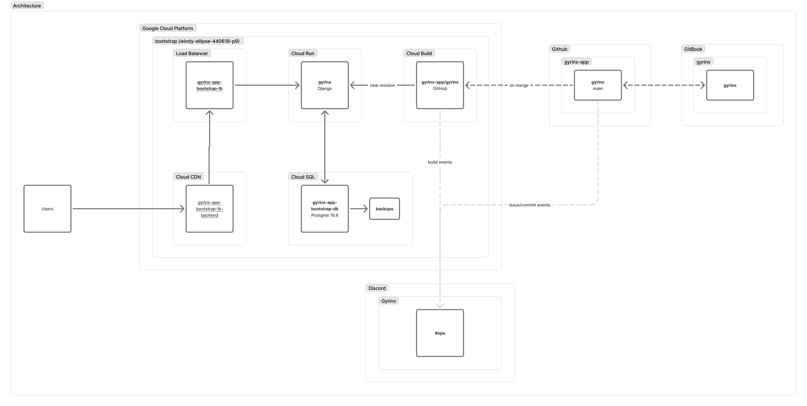

# Overview

This documentation site captures technical documentation for Gyrinx.

Gyrinx is a [Django](https://www.djangoproject.com/) application running in [Google Cloud Platform](https://console.cloud.google.com/). It runs in [Cloud Run](https://cloud.google.com/run), a serverless application platform, with [Cloud SQL (specifically, Postgres)](https://cloud.google.com/sql/postgresql) for data storage. [Cloud Build](https://cloud.google.com/build) is used to deploy the application. The frontend is built with [Bootstrap 5](https://getbootstrap.com/docs/5.0/getting-started/introduction/).

The code is hosted here on [GitHub](https://github.com/gyrinx-app). When new code is pushed on main to the [gyrinx repo](https://github.com/gyrinx-app/gyrinx), it is automatically deployed by Cloud Build. This includes running database migrations. Code is tested automatically in [Github Actions](https://github.com/gyrinx-app/gyrinx/actions).

Analytics are through [Google Analytics](https://analytics.google.com/analytics/web/#/p470310767/reports/intelligenthome?params=_u..nav%3Dmaui).

Project tasks, issues and to-dos are managed in the [Gyrinx GitHub Project](https://github.com/orgs/gyrinx-app/projects/1).

## Project Structure

The project is structured into four Django apps. They are: **core**, **content**, **api** and **pages**.

Within **content** we have the models and admin for the core content library; this is where our content managers spend most of their time on the admin side ensuring that all the data inside Gyrinx is up to date with the Necromunda rulebooks.

In the **core** area we have lists and list fighters and all the functionality that is more user facing.

Within **pages** we have static documentation that you are looking at right now.

At the project level we have a few useful and shared folders or libraries such as overriding core or Django templates to improve the form rendering or to have shared models between the whole application. We manage our settings using three settings files:

* a base file simply called settings.py
* a settings\_dev.py file for local development
* a settings\_prod.py file for production

## Hosting, Database & Migrations

The application is hosted on Google Cloud Run. This was a decision to help mitigate operational overheads and costs. Google Cloud Run scales down to zero when not in use and the Google Cloud Platform offers a huge amount of operational tools and dashboards for free.

We're deployed via Google Cloud Build, which also offers a lot built in.

This deployment process is run directly out of GitHub when code is pushed or merged into main. The database is Postgres and migrations are run when the Docker container spins up in Google Cloud Run.


_There is a potential bug here where if two containers span up at the same time, the migrations could be run simultaneously. This is something to fix in the future._


In front of the application, we have Google Cloud's load balancing offering CDN capabilities.

We use most of the default dashboards built into Google Cloud for observability, and we additionally use web hooks to push specific alerts into our Discord [#ops channel](https://discord.com/channels/1337524316987985963/1337780084102402140).&#x20;

The database structure for core and content look something like this:

<figure><figcaption>
A schema diagram of the Gyrinx Database.
</figcaption></figure>

The most complex interactions are between equipment, assignments, default assignments, and linked fighters.
