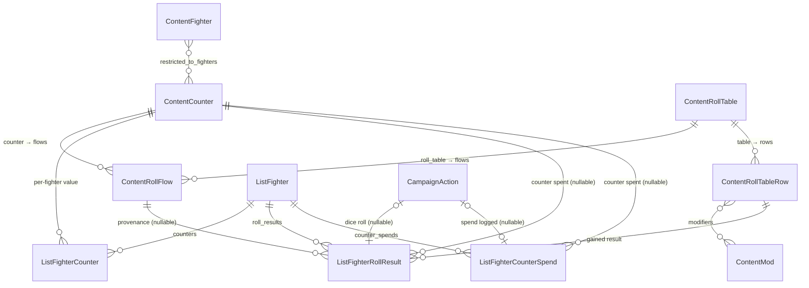

# Counters & Roll Tables

## Overview

Some fighters track a running tally that isn't experience or a wound — the classic example is a Spyrer's **Kill Count** and **Glitch Count**. Counters give content administrators a generic way to attach these tallies to specific fighter types, show them on the fighter card, and let players edit them by hand.

Counters become more than a number when they are wired to a **roll table** through a **roll flow**. A roll flow says "spend N points from this counter, roll on that table, and apply the result you land on." The Spyrer *Suit Evolution* action is exactly this: spend 4 Kill Count, roll a D6 on the Power Boost table, and the fighter gains a permanent upgrade that raises their rating. The result is recorded so it can be reviewed and later removed, reversing both the stat changes and the rating increase.

Counters can also be spent **without** a roll table. A **free-form spend** lets a player take a chosen number of points off a counter and record a written purpose for the expenditure — for rules that call for spending a tally on something that isn't a dice table. Unlike a roll flow this needs **no configuration**: it is available on every counter automatically. Like roll results, each spend is recorded so it can be reviewed and later removed, refunding the points.

Everything here is generic. Nothing in the models mentions Spyrers — you compose the Spyrer feature (or any similar mechanic) entirely out of admin content: two counters, one table with rows, and one flow. In this context a "list" is a user's collection of fighters (a "gang" in Necromunda), and a fighter's "rating" is its point value, summed up into the gang's total.

## How the models fit together

The **content models** (top group) are templates administrators configure. The **user-data models** (`ListFighterCounter`, `ListFighterRollResult`, `ListFighterCounterSpend`) are instances created as players use their gangs. This is the same content-vs-user-data split described in the [content library overview](README.md).

Two of the content models are shared with other systems: `ContentFighter` (see [Fighters & Fighter Types](fighters.md)) and `ContentMod` (see [Modifiers](modifiers.md)).

## Key Concepts

**Counter** (`ContentCounter`): A named tally (e.g. "Kill Count") attached to one or more fighter types. It shows on the fighter card of any fighter whose type is in its `restricted_to_fighters` set, and players edit its value by hand.

**On-demand value** (`ListFighterCounter`): A counter's value for one specific fighter. The card shows every applicable counter at a default of 0; the `ListFighterCounter` record is only created the first time a value is saved. So a fighter can display "Kill Count: 0" without any user-data row existing yet.

**Warning stat**: A counter can name a statline abbreviation (e.g. `T` for Toughness) in its `warning_stat` field. When the counter's value rises above that stat on the fighter's current statline, the badge turns red with a tooltip. This surfaces the Spyrer rule where a Glitch Count higher than Toughness means the hunting rig shuts down — the highlight is a prompt for the player; the app does not delete the fighter automatically.

**Roll table** (`ContentRollTable`): A dice table (D6, 2D6, or D66) made of rows.

**Roll table row** (`ContentRollTableRow`): One result on a table. It matches a dice value or range (`roll_value`, e.g. `"1"` or `"2-3"`), carries modifiers that change the fighter, and defines a `rating_increase` applied when gained.

**Roll flow** (`ContentRollFlow`): The link between a counter and a table — "spend `cost` points from `counter`, roll on `roll_table`." This is what turns a passive tally into an action players can perform.

**Roll result** (`ListFighterRollResult`): The record that a fighter gained a specific row through a flow. It copies the counter cost and rating increase at the moment it is gained, so removing it later reverses the correct amounts even if the content has since been re-priced.

**Free-form spend** (`ListFighterCounterSpend`): The record that a player spent a chosen number of points from a counter with a written purpose, without rolling on a table. It has no rating impact; removing it refunds the points. This path needs no admin setup and works on any counter.

## Models

### `ContentCounter`

A named tally attached to specific fighter types.

#### Fields

| Field | Type | Description |
|-------|------|-------------|
| `name` | CharField (255), unique | The counter's display name, shown on the fighter card and counter edit page. For example, "Kill Count" or "Glitch Count". |
| `description` | TextField (blank) | Optional explanation shown on the counter edit page. |
| `restricted_to_fighters` | ManyToManyField to `ContentFighter` (blank) | Which fighter types show this counter. If empty, no fighter shows it. |
| `display_order` | PositiveIntegerField (default: 0) | Ordering on the fighter card; lower numbers appear first. |
| `warning_stat` | CharField (10, blank) | Optional statline abbreviation (e.g. `T`). When the counter value exceeds this stat, the card badge is highlighted red. Leave blank for no warning. |

#### Relationships

- Has many `ContentRollFlow` records through the `flows` reverse relation.
- Has many `ListFighterCounter` records (per-fighter values) through the `fighter_values` reverse relation.
- References `ContentFighter` through `restricted_to_fighters`.

#### Admin Configuration

The list view shows `name`, `description`, `display_order`, and `warning_stat`. `restricted_to_fighters` uses a horizontal filter widget. Roll flows that spend this counter are edited inline at the bottom of the counter's page, so you can define a counter and its "spend" action in one place.

### `ContentRollTable`

A dice table definition.

#### Fields

| Field | Type | Description |
|-------|------|-------------|
| `name` | CharField (255), unique | The table's name, e.g. "Power Boost". |
| `description` | TextField (blank) | Optional explanation shown above the table when rolling. |
| `dice` | CharField (choices) | The dice used: `D6` (one die), `2D6` (two dice summed), or `D66` (two dice read as tens-and-units, giving 11–66). |

#### Behaviour

The table knows how to interpret its own dice: a `D6` needs one die, `2D6`/`D66` need two. For `2D6` the dice are summed; for `D66` the first die is the tens and the second is the units, so a 4 and a 5 read as **45**, not 9. When resolving a roll, the table walks its rows in order and returns the first whose `roll_value` range contains the result. A malformed `roll_value` is skipped (and logged) rather than breaking the roll, and if no row matches, the player is shown a "roll again" message instead of a broken page.

#### Relationships

- Has many `ContentRollTableRow` records through the `rows` reverse relation.
- Has many `ContentRollFlow` records through the `flows` reverse relation.

#### Admin Configuration

The list view shows `name`, `dice`, and `description`, filterable by `dice`. Rows are edited inline, ordered by `sort_order`.

### `ContentRollTableRow`

One result on a roll table.

#### Fields

| Field | Type | Description |
|-------|------|-------------|
| `table` | ForeignKey to `ContentRollTable` | The parent table. Deleting the table deletes its rows. |
| `roll_value` | CharField (20) | The dice result this row matches: a single value (`"6"`) or an inclusive range (`"2-3"`). For a D66 table use the combined value (`"11-16"`). |
| `name` | CharField (255) | The result's name, e.g. "Improved Reflexes". |
| `description` | TextField (blank) | What the result does, shown on the confirm step. |
| `modifiers` | ManyToManyField to `ContentMod` (blank) | Stat/trait/rule/skill changes applied to the fighter while they hold this result. Uses the shared modifier system — see [Modifiers](modifiers.md). |
| `rating_increase` | IntegerField (default: 0) | Credits added to the fighter's rating when this result is gained. |
| `sort_order` | PositiveIntegerField (default: 0) | Display order within the table. Unique per table. |

#### Relationships

- Belongs to a `ContentRollTable` through `table`.
- References `ContentMod` through `modifiers`.
- Has many `ListFighterRollResult` records (fighters who gained it) through the `fighter_results` reverse relation.

### `ContentRollFlow`

Links a counter to a table, defining a "spend and roll" action.

#### Fields

| Field | Type | Description |
|-------|------|-------------|
| `name` | CharField (255) | The action's name, e.g. "Suit Evolution". Shown as the button label on the counter edit page. |
| `description` | TextField (blank) | Optional instructions shown to the player. |
| `counter` | ForeignKey to `ContentCounter` | The counter whose points are spent. |
| `cost` | PositiveIntegerField | How many points to spend per roll. |
| `roll_table` | ForeignKey to `ContentRollTable` | The table to roll on. |

#### Relationships

- Belongs to a `ContentCounter` through `counter` and a `ContentRollTable` through `roll_table`.
- Has many `ListFighterRollResult` records through the `fighter_results` reverse relation.

#### Admin Configuration

The list view shows `name`, `counter`, `cost`, and `roll_table`. Flows can be created standalone, or inline from the counter they spend.

### `ListFighterCounter` (user data)

The value of one counter for one fighter. Created on demand the first time a value is saved. Inherits the standard user-data behaviour (UUID id, ownership, archive, history).

#### Fields

| Field | Type | Description |
|-------|------|-------------|
| `fighter` | ForeignKey to `ListFighter` | The fighter this value belongs to. |
| `counter` | ForeignKey to `ContentCounter` | Which counter. |
| `value` | IntegerField (default: 0) | The current value. |

A fighter can hold at most one value row per counter (`fighter` + `counter` is unique).

### `ListFighterRollResult` (user data)

A record that a fighter gained a specific roll-table row. This is both a modifier source (the row's modifiers apply to the fighter) and a cost source (its `rating_increase` counts towards the fighter's rating). Inherits the standard user-data behaviour, so removal is a soft archive that keeps history.

#### Fields

| Field | Type | Description |
|-------|------|-------------|
| `fighter` | ForeignKey to `ListFighter` | The fighter who gained the result. |
| `row` | ForeignKey to `ContentRollTableRow` | The row that was gained. |
| `flow` | ForeignKey to `ContentRollFlow` (nullable) | The flow that produced it, kept for provenance. Nullable so deleting a flow doesn't erase history. |
| `counter` | ForeignKey to `ContentCounter` (nullable) | The counter that was spent, kept so removal can refund the right counter. |
| `counter_cost` | IntegerField (default: 0) | Points spent, copied from the flow at gain time. |
| `rating_increase` | IntegerField (default: 0) | Rating increase, copied from the row at gain time. |
| `date_received` | DateTimeField (auto) | When it was gained. |
| `notes` | TextField (blank) | Optional notes. |
| `campaign_action` | OneToOneField to `CampaignAction` (nullable) | The logged dice roll, in campaign mode. |

**Why the amounts are copied.** `counter_cost` and `rating_increase` are stored on the result rather than read live from the flow and row. If an administrator later re-prices a table row, existing results keep the value that was actually applied — so removing an old boost refunds and reverses the correct amount, and the gang's books stay consistent. This mirrors how [advancements](advancements.md) store their own `cost_increase`.

### `ListFighterCounterSpend` (user data)

A record that a player spent points from a counter without a roll flow — no dice, no table row, and no rating impact. It exists purely as an auditable, refundable log of a free-form expenditure. Inherits the standard user-data behaviour, so removal is a soft archive that keeps history.

#### Fields

| Field | Type | Description |
|-------|------|-------------|
| `fighter` | ForeignKey to `ListFighter` | The fighter who spent the points. |
| `counter` | ForeignKey to `ContentCounter` (nullable) | The counter that was spent, kept so removal can refund the right counter. |
| `amount` | PositiveIntegerField | Points spent (chosen by the player, 1 up to the current value). |
| `reason` | TextField (blank) | The purpose of the spend, entered by the player. |
| `date_spent` | DateTimeField (auto) | When the points were spent. |
| `campaign_action` | OneToOneField to `CampaignAction` (nullable) | The logged spend, in campaign mode. |

Unlike a roll result, a spend carries no `rating_increase` — spending a counter never changes a fighter's cost or the gang's rating. There is no content model to configure; the spend UI appears on every counter automatically.

## How It Works in the Application

### Counters on the fighter card

A fighter shows a row for every counter whose `restricted_to_fighters` set includes its fighter type, next to XP. Each row shows the current value (0 if never edited) and an Edit link. If a counter has a `warning_stat` and the value exceeds that stat, the badge is red with a "•" and a tooltip. Counters are visible in all list modes, not just campaign mode.

### Editing a counter

The Edit link opens a simple page where the owner (or the campaign's arbitrator) sets the value. Saving a value for the first time creates the `ListFighterCounter` record. Below the value, the page has a **Spend** section for free-form spends (see below), a list of any recorded spends, and — for counters wired to a table — a list of roll flows, each with a Start button greyed out with a "Requires N" note when the fighter can't yet afford it.

### Spending a counter freely

Whenever a counter's value is above zero, the counter edit page shows a **Spend** form: an amount and a **Purpose** field. Submitting it subtracts the amount from the counter and records a `ListFighterCounterSpend` with the purpose. In campaign mode the spend is also written to the campaign action log (the purpose is included in the description). This works in every list mode and needs no admin configuration — it is available on all counters.

Recorded spends are listed on the same page, each with a **Remove** button. Removing a spend archives the record and refunds the amount back to the counter (and, in campaign mode, logs a reversing action). Because a spend has no rating impact, removing one only moves the counter — it never touches the fighter's cost or the gang's rating.

### The roll flow

Starting a flow is a two-step, shareable wizard:

1. **Roll** — The page shows the whole table so the player sees what's possible, then offers either an automatic roll or manual entry of dice rolled at the tabletop. In campaign mode the dice are written to the campaign action log immediately, before the result is confirmed, so rolls can't be quietly re-tried.

2. **Confirm** — The matched row is shown with its stat changes and rating increase. Confirming spends the counter points, records a `ListFighterRollResult`, raises the fighter's rating, and (in campaign mode) sets the outcome on the logged action.

The roll being confirmed is carried in the URL, so refreshing or sharing the confirm page shows the same result rather than re-rolling. Applying the same logged roll twice is safe — the second attempt is recognised and ignored.

### Effect on fighter cost and rating

When a result is gained, its `rating_increase` is added to the fighter's cost, which propagates up to the list's `rating_current` (or `stash_current` for stash-linked fighters). The increase participates in every cost calculation the same way an advancement's `cost_increase` does, so audit and reconcile see a consistent value.

### Removing a result

From the fighter card, the roll-table row links to a list of results, each with a Remove option. Removing a result archives it, reverses its stat modifiers, subtracts its `rating_increase` from the fighter, and refunds the `counter_cost` back to the counter. In campaign mode the removal is logged.

### Cloning

When a fighter is cloned, their counter values and roll results are copied too (the results unlinked from their original campaign actions). This keeps a clone's rating consistent with its computed cost.

## Common Admin Tasks

### Setting up Spyrer Kill Count, Glitch Count & Power Boost

This is the end-to-end recipe for the Spyrer feature. It assumes the Spyrer fighter types and the "Spyrer Glitches" injury group already exist (they are configured like any other [fighters](fighters.md) and [injuries](injuries.md)).

1. **Create the Kill Count counter.**
   - Counters → Add. Name: `Kill Count`, display order `0`.
   - Under `restricted_to_fighters`, add every Spyre Hunter fighter type that should track kills (not the gang's Stash entry).
   - Leave `warning_stat` blank. Save.

2. **Create the Glitch Count counter.**
   - Counters → Add. Name: `Glitch Count`, display order `1`.
   - Add the same fighter types to `restricted_to_fighters`.
   - Set `warning_stat` to `T` so the badge turns red once Glitch Count passes Toughness. Save.

3. **Create the Power Boost table.**
   - Roll Tables → Add. Name: `Power Boost`, dice `D6`. Save.
   - Add one row per result from the rulebook via the inline rows section. For each: set `sort_order` (1, 2, 3…), `roll_value` (`"1"`, `"2"`, … or ranges like `"1-2"`), `name`, the `rating_increase`, and attach the stat `modifiers` for that result. Save.

4. **Create the Suit Evolution flow.**
   - On the Kill Count counter's page, use the inline flows section (or Roll Flows → Add). Name: `Suit Evolution`, cost `4`, roll table `Power Boost`. Save.

Players with a Spyrer fighter can now edit Kill Count and Glitch Count on the fighter card. Once Kill Count reaches 4, the "Suit Evolution" button appears on the Kill Count edit page. Glitch Count is bumped by hand as fighters take Spyrer Glitches injuries; when it exceeds Toughness the badge warns the player to act.

### Creating any counter

1. Counters → Add. Give it a `name` and `display_order`.
2. Add the fighter types that should show it to `restricted_to_fighters`. An empty set means no fighter shows the counter.
3. Optionally set `warning_stat` to a statline abbreviation to get the red highlight when the value exceeds that stat.

Players can immediately edit the counter and record free-form spends against it — no roll table or flow is required. Wire up a table and flow only if you also want a "spend and roll" action (below).

### Building a roll table

1. Roll Tables → Add. Set `name` and choose the `dice` type.
2. Add rows inline. Cover the full range of the dice so every possible roll matches a row — a D6 table needs results for 1 through 6; a gap means a player can roll a value with no result and be asked to roll again.
3. For each row, set the `roll_value` (single or range), `rating_increase`, and any `modifiers`.

For a D66 table, use combined values in `roll_value` (e.g. `"11-16"`, `"21-26"`), not the raw dice.

### Wiring a counter to a table

1. Roll Flows → Add (or use the inline section on the counter).
2. Set `name` (this is the button players see), pick the `counter` and `roll_table`, and set the `cost`.
3. A counter can have several flows — for example a cheap and an expensive option rolling on different tables.

### Attaching modifiers to a result

Roll-table row modifiers use the same polymorphic `ContentMod` system as equipment and injuries. Open a `ContentRollTableRow`, use the `modifiers` horizontal filter to attach stat, trait, rule, or skill modifiers, and save. See [Modifiers](modifiers.md) for the full range of modifier types.
