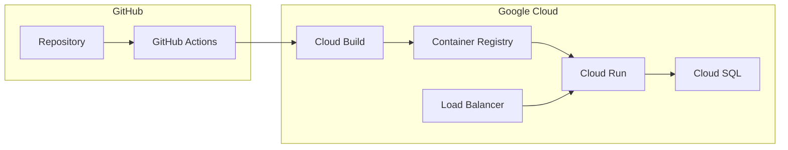

# Deployment

Gyrinx is deployed on Google Cloud Platform using Cloud Run for the application and Cloud SQL for the database. The deployment process is fully automated through GitHub and Google Cloud Build.

## Architecture Overview



## Deployment Pipeline

### Automatic Deployment

1. **Code Push** - Developer pushes to `main` branch
2. **GitHub Actions** - Runs tests and checks
3. **Cloud Build Trigger** - Automatically triggered on main branch changes
4. **Container Build** - Docker image built from `Dockerfile`
5. **Deploy to Cloud Run** - New image deployed automatically
6. **Database Migrations** - Run automatically on container startup

### Build Configuration

**cloudbuild.yaml**

```yaml
steps:
  # Build Docker image
  - name: 'gcr.io/cloud-builders/docker'
    args: ['build', '-t', 'gcr.io/$PROJECT_ID/gyrinx:$COMMIT_SHA', '.']

  # Push to Container Registry
  - name: 'gcr.io/cloud-builders/docker'
    args: ['push', 'gcr.io/$PROJECT_ID/gyrinx:$COMMIT_SHA']

  # Deploy to Cloud Run
  - name: 'gcr.io/cloud-builders/gcloud'
    args: ['run', 'deploy', 'gyrinx',
           '--image', 'gcr.io/$PROJECT_ID/gyrinx:$COMMIT_SHA',
           '--region', 'europe-west2',
           '--platform', 'managed']
```

## Environment Configuration

### Production Settings

- **Database**: Cloud SQL PostgreSQL
- **Static Files**: Served by WhiteNoise
- **Security**: HTTPS enforced, secure headers
- **Scaling**: Automatic based on traffic

### Environment Variables

```bash
# Database configuration
DB_CONFIG='{"user": "username", "password": "password"}'
DB_NAME=gyrinx
DB_HOST=cloud_sql_proxy_ip
DB_PORT=5432

# Django settings
SECRET_KEY=production_secret_key
ALLOWED_HOSTS='["gyrinx.app", "www.gyrinx.app"]'
CSRF_TRUSTED_ORIGINS='["https://gyrinx.app"]'

# External services
GOOGLE_ANALYTICS_ID=GA_tracking_id
PATREON_HOOK_SECRET=patreon_webhook_secret
```

## Database Management

### Migrations

Migrations run automatically when the container starts:

```dockerfile
# In Dockerfile
ENTRYPOINT ["./docker/entrypoint.sh"]
```

```bash
# docker/entrypoint.sh
#!/bin/bash
python manage.py migrate --noinput
python manage.py collectstatic --noinput
exec "$@"
```

### Database Backups

- **Automatic Backups**: Cloud SQL provides automatic daily backups
- **Point-in-time Recovery**: Available for disaster recovery
- **Manual Backups**: Can be triggered before major deployments

### Database Access

```bash
# Connect to production database (requires Cloud SQL Proxy)
gcloud sql connect gyrinx-app-bootstrap-db --user=postgres

# Run migrations manually (if needed)
gcloud run jobs execute migrate-job --region=europe-west2
```

## Monitoring and Observability

### Cloud Run Monitoring

- **Metrics**: Request count, latency, memory usage
- **Logs**: Application logs and access logs
- **Alerts**: Configured for high error rates and latency

### Health Checks

```python
# In Django urls.py
urlpatterns = [
    path('health/', health_check_view, name='health'),
]

def health_check_view(request):
    # Basic health check
    return JsonResponse({'status': 'healthy'})
```

### Alerting

- **Discord Integration**: Alerts sent to `#ops` channel
- **Error Tracking**: 500 errors and exceptions
- **Performance Monitoring**: Slow requests and high memory usage

## Security

### HTTPS and SSL

- **Automatic SSL**: Cloud Run provides automatic SSL certificates
- **Security Headers**: Configured in Django settings
- **CSRF Protection**: Enforced for all POST requests

### Access Control

- **IAM Roles**: Principle of least privilege
- **Service Accounts**: Separate accounts for different services
- **Secret Management**: Environment variables for sensitive data

### Security Scanning

- **Container Scanning**: Automatic vulnerability scanning
- **Dependency Updates**: Regular security updates
- **Code Analysis**: GitHub Security Advisories

## Performance Optimization

### Cloud Run Configuration

```yaml
# service.yaml
spec:
  template:
    metadata:
      annotations:
        autoscaling.knative.dev/maxScale: "10"
        autoscaling.knative.dev/minScale: "0"
        run.googleapis.com/cpu-throttling: "false"
    spec:
      containerConcurrency: 80
      timeoutSeconds: 900
      containers:
      - resources:
          limits:
            cpu: "2"
            memory: "2Gi"
```

### Database Performance

- **Connection Pooling**: Configured in Django settings
- **Read Replicas**: Available for read-heavy workloads
- **Query Optimization**: Regular performance monitoring

## Disaster Recovery

### Backup Strategy

1. **Database Backups**: Daily automatic backups with 7-day retention
2. **Point-in-time Recovery**: Up to 7 days
3. **Code Repository**: Git provides complete history
4. **Container Images**: Stored in Container Registry

### Recovery Procedures

```bash
# Restore from backup (example)
gcloud sql backups restore BACKUP_ID --restore-instance=gyrinx-restored

# Rollback deployment
gcloud run deploy gyrinx --image=gcr.io/PROJECT/gyrinx:PREVIOUS_SHA
```

## Deployment Checklist

### Pre-deployment

- [ ] Tests pass in CI/CD
- [ ] Database migrations tested locally
- [ ] Feature flags configured (if applicable)
- [ ] Monitoring alerts updated

### Post-deployment

- [ ] Health check passes
- [ ] Key user flows tested
- [ ] Error rates monitored
- [ ] Performance metrics checked

## Troubleshooting

### Common Issues

**Migration Failures**

```bash
# Check migration status
python manage.py showmigrations

# Apply specific migration
python manage.py migrate app_name migration_name
```

**Container Start Failures**

```bash
# Check Cloud Run logs
gcloud logging read "resource.type=cloud_run_revision" --limit=50

# Debug locally
docker run -it --rm gyrinx:latest /bin/bash
```

**Database Connection Issues**

```bash
# Test database connection
python manage.py dbshell

# Check Cloud SQL status
gcloud sql instances describe gyrinx-app-bootstrap-db
```

### Performance Issues

- Monitor Cloud Run metrics for CPU/memory usage
- Check database query performance
- Review Django debug toolbar output locally

## Cost Optimization

### Resource Management

- **Auto-scaling**: Scales to zero when not in use
- **Right-sizing**: Monitor resource usage and adjust limits
- **Database Sizing**: Regular review of database performance tiers

### Monitoring Costs

- **Budget Alerts**: Set up billing alerts
- **Resource Usage**: Regular review of Cloud Console metrics
- **Optimization Opportunities**: Identify unused resources

## Future Improvements

### Staging Environment

- Consider adding a staging environment for testing
- Could use Cloud Run with separate database
- Automated testing on staging before production

### Advanced Monitoring

- Application Performance Monitoring (APM)
- Real User Monitoring (RUM)
- Error tracking with detailed stack traces

### CI/CD Enhancements

- Canary deployments
- Blue-green deployments
- Automated rollback on failures
