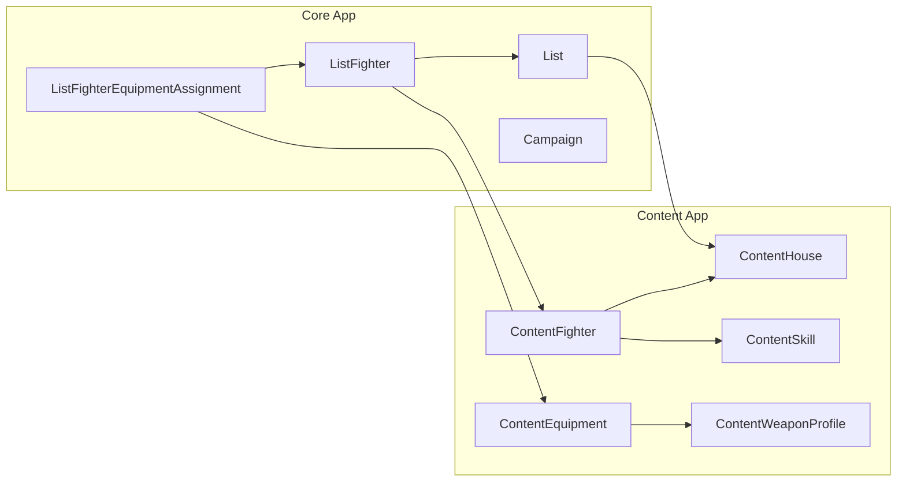

# Models and Database

Gyrinx uses Django's ORM with PostgreSQL as the database. The application is structured around four main apps, each with distinct responsibilities and model relationships.

## Database Architecture

### Base Models

All application models inherit from `AppBase`, which provides:

```python
# gyrinx/core/models/base.py
class AppBase(HistoryMixin, Base, Owned, Archived):
    objects = HistoryAwareManager()
```

This inheritance chain provides:

- **UUID primary keys** (`Base`)
- **Owner tracking** (`Owned`) - links models to users
- **Archive functionality** (`Archived`) - soft delete capability
- **History tracking** (`HistoryMixin`) - audit trail
- **Custom manager** (`HistoryAwareManager`) - enhanced operations

### Core Model Relationships



## Content App Models

The content app contains the game's static data - official Necromunda rules and equipment.

### Core Content Models

**ContentHouse**

- Represents Necromunda gangs/houses (Goliath, Escher, etc.)
- Links to available fighters, equipment, and house-specific rules

**ContentFighter**

- Base fighter templates (Leader, Champion, Ganger, etc.)
- Defines stats, equipment options, and advancement paths
- Links to house and available equipment lists

**ContentEquipment**

- All equipment items (weapons, armor, gear)
- Complex relationship system with profiles and upgrades
- Cost calculations based on fighter type and house

**ContentWeaponProfile**

- Weapon statistics (range, strength, damage, etc.)
- Multiple profiles per weapon (different ammo types)
- Cost modifiers and availability restrictions

### Supporting Models

- **ContentSkill** - Available skills and their effects
- **ContentRule** - Game rules and special abilities
- **ContentPsykerPower** - Psychic powers and disciplines
- **ContentEquipmentUpgrade** - Weapon modifications and cyberteknika
- **ContentWeaponAccessory** - Weapon attachments (scopes, etc.)

## Core App Models

The core app handles user-created content - lists, gangs, and campaigns.

### List Building Models

**List**

- User-created gang lists for planning and experimentation
- Links to a ContentHouse for validation and options
- Cost calculations and equipment assignments

**ListFighter**

- Instance of a ContentFighter within a user's list
- Can override base costs and stats
- Manages equipment assignments and skill selections

**ListFighterEquipmentAssignment**

- Links a ListFighter to ContentEquipment
- Handles cost overrides, weapon profiles, and accessories
- Supports complex equipment configurations

### Campaign Models

**Campaign**

- Container for narrative campaigns with multiple participating gangs
- Three status phases: pre-campaign, in-progress, post-campaign
- Tracks participating lists, narrative, and summary
- When started, clones all participating lists for campaign-specific tracking

**CampaignAction**

- Records player actions during campaigns
- Supports optional dice rolls (D6)
- Tracks outcomes and results
- Immutable audit log of campaign events

**CampaignAssetType**

- Defines types of assets (e.g., Territory, Relic)
- Singular and plural naming
- Rich text descriptions
- Campaign-specific configuration

**CampaignAsset**

- Individual assets that can be held by gangs
- Links to asset type and current holder
- Supports transfers between gangs
- Full history tracking

**CampaignResourceType**

- Defines countable resources (e.g., Credits, Ammunition)
- Default amounts allocated on campaign start
- Rich text descriptions

**CampaignListResource**

- Tracks resource amounts for each gang
- Supports modifications with validation
- Cannot go below zero
- Creates action log entries on changes

## Virtual Models

Gyrinx uses "virtual" models to abstract over different data sources:

```python
class VirtualListFighterEquipmentAssignment:
    """Represents equipment assignment from either:
    - Direct assignment (ListFighterEquipmentAssignment)
    - Default assignment (ContentFighterDefaultAssignment)
    - No assignment (for editing forms)
    """
```

This pattern allows the UI to treat all equipment consistently regardless of source.

## Cost Calculation System

Gyrinx implements a layered cost calculation system:

### Fighter Cost

1. Base ContentFighter cost
2. House-specific overrides
3. Manual user overrides
4. Sum of equipment assignment costs

### Equipment Cost

1. Base equipment cost (from equipment list or trading post)
2. Weapon profile costs (special ammo)
3. Accessory costs (scopes, etc.)
4. Upgrade costs (cyberteknika)

### Implementation

```python
# Costs are calculated dynamically via annotations
fighters = ListFighter.objects.with_calculated_cost()
equipment = ContentEquipment.objects.with_cost_for_fighter(fighter)
```

## Database Migrations

### Development Workflow

```bash
# Create migration after model changes
manage makemigrations content -n "descriptive_migration_name"

# Create empty migration for data changes
manage makemigrations --empty content

# Apply migrations
manage migrate

# Check for issues
./scripts/check_migrations.sh
```

### Migration Best Practices

- Use descriptive names for migrations
- Test migrations on production data dumps
- Consider migration dependencies between apps
- Use data migrations for complex transformations

## Performance Considerations

### Query Optimization

- Use `select_related()` for foreign keys
- Use `prefetch_related()` for many-to-many relationships
- Annotate calculated fields at the database level
- Cache expensive computations

### Database Indexes

Key indexes are automatically created for:

- Foreign key relationships
- UUID primary keys
- History tracking fields
- Frequently queried fields

### Example Optimized Queries

```python
# Efficient list loading with all relationships
lists = List.objects.select_related(
    'content_house', 'owner'
).prefetch_related(
    'listfighter_set__content_fighter',
    'listfighter_set__equipment'
)

# Annotated cost calculations
fighters = ListFighter.objects.annotate(
    total_cost=F('base_cost') + F('equipment_cost')
)
```

## Testing Database Models

### Model Tests

```python
@pytest.mark.django_db
def test_list_fighter_cost_calculation():
    house = ContentHouse.objects.create(name="Test House")
    fighter = ContentFighter.objects.create(
        name="Test Fighter",
        cost=100,
        house=house
    )

    list_fighter = ListFighter.objects.create(
        content_fighter=fighter,
        list=test_list
    )

    assert list_fighter.calculated_cost == 100
```

### Migration Tests

```python
def test_migration_preserves_data():
    # Test that migrations don't lose or corrupt data
    # Particularly important for complex schema changes
```

## Schema Evolution

### Adding New Models

1. Create model in appropriate app
2. Inherit from `AppBase` for standard functionality
3. Add relationships carefully to avoid circular imports
4. Create migration and test with existing data

### Modifying Existing Models

1. Consider backward compatibility
2. Use database migrations for schema changes
3. Use data migrations for data transformations
4. Test on production data dump

### Deprecating Models

1. Mark as deprecated in docstrings
2. Remove from admin and forms first
3. Keep model for historical data access
4. Eventually remove with major version bump
