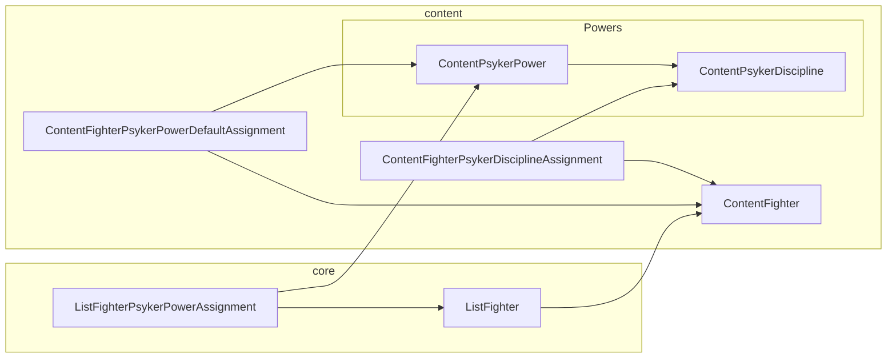

# Psykers

A Psyker is any ContentFighter with one of the following rules:

- Psyker
- Non-sanctioned Psyker
- Sanctioned Psyker

Like equipment, Psyker Powers can be assigned by default (`ContentFighterPsykerPowerDefaultAssignment`) or directly assigned (`ListFighterPsykerPowerAssignment`).&#x20;

These assignment classes link the fighter to a power (`ContentPsykerPower`). The power is linked to a discipline (`ContentPsykerDiscipline`).

The overall structure looks like this:

## Important Classes

`ContentFighterPsykerDisciplineAssignment`

Links a `ContentFighter` to the `ContentPsykerDiscipline` from which the fighter is allowed to take `ContentPsykerPower`. This is enforced when the `ContentFighter` or `ListFighter` model `clean()` method is called, in the case of default or direct assignments respectively.

### `ContentFighterPsykerPowerDefaultAssignment`&#x20;

Assigns a particular `ContentPsykerPower` to a `ContentFighter`  by default.

### `ListFighterPsykerPowerAssignment`&#x20;

Assigns a `ContentPsykerPower`  to a `ListFighter`  directly. The `ContentPsykerPower`  must be associated with the `ContentPsykerDiscipline`  that is assigned to the `ListFighter` 's associated `ContentFighter` .

### Managing power assignments

Like with equipment, we use a "virtual" assignment class to abstract over the different kinds of assignment. These can either be backed by a default assignment, a direct assignment, or no assignment at all. The latter case is use for the editing form when managing powers.
