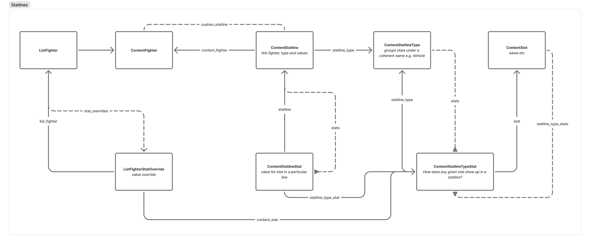

# Statlines

There are two statline systems in Gyrinx:

There are two statline systems:

1. **Old:** one simple, legacy version that has a base list of stats on the `ContentFighter`, and `_override` fields for each stat on the `ListFighter`
2. **New:** A more complex, powerful version that allows custom statline types to be created and assigned to `ContentFighter`, with overrides stored separately, and with specific underlying stats reused across statline types

In either case, the flow goes something like this:

1. Get the statline for the underlying content fighter
2. Apply any overrides from the list fighter
3. Apply any mods from the list fighter

The more complex system is, without optimisation, massively more expensive to compute due to N+1 queries.

It allows custom statlines to be created to support vehicles and crew, for example:

<figure><figcaption></figcaption></figure>

Here's the models relationship for quick reference:

<figure><figcaption></figcaption></figure>
